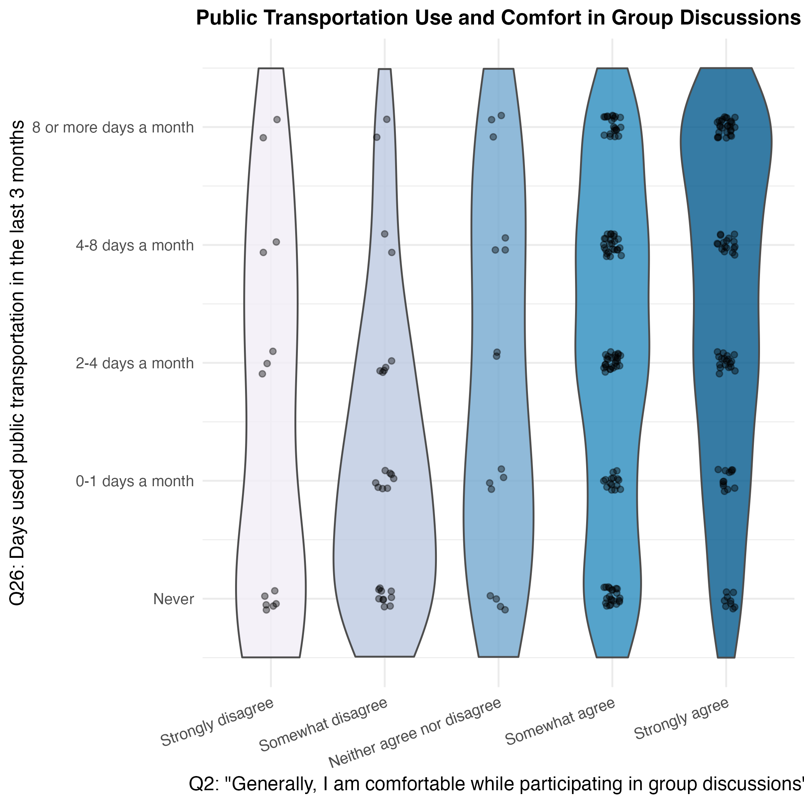

# Introduction
This manuscript is our submission for the summer semester project for Psych 755 at UW-Madison and its course entitled Tools for Large Scale Data Science. In this project we demonstrate usage of the following tools: Python, R, Markdown, Quarto, Github, and Agentic IDEs. 

## Lit Review 

## Research Questions

Our overarching research question explored whether public transportation usage was a function of group communication apprehension. We investigated that relationship with the following questions:

- **RQ1:** Does group communication apprehension correlate with public transportation usage?
  - $H_0$: There is no correlation between group communication apprehension and public transportation usage.
  - $H_a$: There is a correlation between group communication apprehension and public transportation usage. 

- **RQ2:** Does a person's number of days they used public transportation per month on average over the last 3 months predict their composite communication apprehension score from responses to questions about their confidence in conversations?
  - $H_0$: 
  - $H_a$: 

- **RQ3:** Do individuals who feel comfortable in group discussions use public transportation more on a regular basis?
  - $H_0$: Individuals who feel comfortable in group discussions do not use public transportation more on a regular basis.
  - $H_a$: Individuals who feel comfortable in group discussions do use public transportation more on a regular basis.

# Data & Methods

## Data Preparation

### Data Collection and Merging

Our data was collected from Prolific and Qualtrics Survey responses. We combined two Prolific demographic datasets (File A and File B) using pandas concatenation, then merged them with the Qualtrics survey responses. The merging process involved standardizing participant ID columns across datasets and performing an inner join on participant IDs to ensure that only complete records would be retained in the final merged dataset.


### Data Cleaning and Coding

We prepared our data for analysis by recoding survey responses to questions about communication apprehension to numeric values on a 5-point scale: Responses of “Strongly disagree” to questions about communication apprehension were coded as 1, “Somewhat disagree” as 2, “Neither agree nor disagree” as 3, “Somewhat agree” as 4, and “Strongly agree” as 5, and the reverse was true for reverse coded questions that asked about communication confidence. We then added the total number for each question response about communication apprehension or confidence together to get a total composite score for communication apprehension.

### Descriptive Statistics


```{python}
#| label: descriptive-stats
#| include: false
import pandas as pd
import numpy as np
from scipy import stats

data_dir = "~/Desktop/Summer Semester/Summer2026DSHBData"

# Load datasets
prolific_a = pd.read_csv(f"{data_dir}/PRCAProlificExport_FileA.csv")
prolific_b = pd.read_csv(f"{data_dir}/PRCAProlificExport_FileB.csv")
qualtrics = pd.read_csv(f"{data_dir}/PRCAQualtricsExport_FileC.csv")

# Combine Prolific datasets
prolific_combined = pd.concat([prolific_a, prolific_b], ignore_index=True)

# Rename participant ID column for merging
prolific_combined = prolific_combined.rename(columns={'Participant id': 'participant_id'})
qualtrics = qualtrics.rename(columns={'Q0': 'participant_id'})

# Merge datasets on participant ID
merged_data = pd.merge(qualtrics, prolific_combined, on='participant_id', how='inner')

# Likert scale mapping (for communication apprehension)
likert_mapping = {
    'Strongly disagree': 1,
    'Somewhat disagree': 2,
    'Neither agree nor disagree': 3,
    'Somewhat agree': 4,
    'Strongly agree': 5
}

# transportation usage
usage_mapping = {
    'Never': 0,
    '0-1 days a month': 1,
    '2-4 days a month': 2,
    '4-8 days a month': 3,
    '8 or more days a month': 4
}

# Convert communication apprehension items (Q1-Q6, Q13-Q18) to numeric
ca_items = ['Q1', 'Q2', 'Q3', 'Q4', 'Q5', 'Q6', 'Q13', 'Q14', 'Q15', 'Q16', 'Q17', 'Q18']
reverse_coded = ['Q2', 'Q4', 'Q6', 'Q14', 'Q16', 'Q17']

for item in ca_items:
    if item in merged_data.columns:
        merged_data[item + '_num'] = merged_data[item].map(likert_mapping)
        # Reverse code items (1->5, 2->4, 3->3, 4->2, 5->1)
        if item in reverse_coded:
            merged_data[item + '_num'] = 6 - merged_data[item + '_num']

# Calculate communication apprehension mean score
ca_numeric_cols = [item + '_num' for item in ca_items if item + '_num' in merged_data.columns]
merged_data['ca_mean'] = merged_data[ca_numeric_cols].mean(axis=1, skipna=True)

# Convert transportation usage items (Q26-Q29) to numeric
pt_items = ['Q26', 'Q27', 'Q28', 'Q29']
for item in pt_items:
    if item in merged_data.columns:
        merged_data[item + '_num'] = merged_data[item].map(usage_mapping)

# Calculate public transportation usage mean score
pt_numeric_cols = [item + '_num' for item in pt_items if item + '_num' in merged_data.columns]
merged_data['pt_usage_mean'] = merged_data[pt_numeric_cols].mean(axis=1, skipna=True)
```

```{python}
#| label: tbl-descriptive-stats
#| tbl-cap: "Descriptive Statistics for Key Variables"

# Calculate descriptive statistics
ca_stats = {
    'Variable': ['Communication Apprehension Mean', 'Public Transportation Usage Mean', 'Sample Size'],
    'Mean': [merged_data['ca_mean'].mean(), merged_data['pt_usage_mean'].mean(), merged_data['participant_id'].nunique()],
    'Std Dev': [merged_data['ca_mean'].std(), merged_data['pt_usage_mean'].std(), 'N/A'],
    'Min': [merged_data['ca_mean'].min(), merged_data['pt_usage_mean'].min(), 'N/A'],
    'Max': [merged_data['ca_mean'].max(), merged_data['pt_usage_mean'].max(), 'N/A']
}

pd.DataFrame(ca_stats)
```

This table explains the key descriptive statistics of our merged dataset. The communication apprehension mean score represents the average response across 12 survey items (Q1-Q6, Q13-Q18) measuring comfort with group communication, with appropriate reverse coding applied to items Q2, Q4, Q6, Q14, Q16, and Q17. The public transportation usage mean score represents the average frequency of public transportation use across 4 survey items (Q26-Q29).


# Results 

## RQ1: Does group communication apprehension correlate with public transportation usage?

To address RQ1, we conducted a simple linear regression analysis examining the correlation between group communication apprehension and public transportation usage. The analysis used the mean communication apprehension score (calculated from 12 survey items with appropriate reverse coding) as the predictor variable and mean public transportation usage score (calculated from 4 survey items) as the outcome variable.

```{python}
#| label: tbl-regression-results
#| tbl-cap: "Regression Results for Communication Apprehension Predicting Public Transportation Usage"

regression_data = merged_data[['ca_mean', 'pt_usage_mean']].dropna()

# regression model
if len(regression_data) > 0 and 'ca_mean' in regression_data.columns and 'pt_usage_mean' in regression_data.columns:
    X = regression_data['ca_mean'].values
    y = regression_data['pt_usage_mean'].values
    
    slope, intercept, r_value, p_value, std_err = stats.linregress(X, y)
    r_squared = r_value**2
    
    # results
    print("### Regression Results")
    print(f"R-squared: {r_squared:.3f}")
    print(f"Sample size: {len(y)}")
    print(f"Slope: {slope:.4f}")
    print(f"Intercept: {intercept:.4f}")
    print(f"p-value: {p_value:.4f}")
    print(f"Standard error: {std_err:.4f}")
else:
    print("*Regression analysis requires actual data files to run properly.*")

table_data = {
    'R-squared': [f"{r_squared:.3f}"],
    'Sample size': [len(y)],
    'Slope': [f"{slope:.4f}"],
    'Intercept': [f"{intercept:.4f}"],
    'p-value': [f"{p_value:.4f}"],
    'Standard error': [f"{std_err:.4f}"]
}

pd.DataFrame(table_data)
```

The regression analysis revealed a significant negative relationship between group communication apprehension and public transportation usage. The slope of -0.4147 indicates that as communication apprehension increases, public transportation usage decreases. The R-squared value of 0.108 implies that approximately 10.8% of the variance in public transportation usage can be explained by communication apprehension. The p-value < 0.001 indicates that this relationship is statistically significant, which led us to reject the null hypothesis and conclude that there is a correlation between group communication apprehension and public transportation usage.

## RQ2- Does a person's number of days they used public transportation per month on average over the last 3 months predict their composite communication apprehension score from responses to questions about their confidence in conversations?

Our research memo for Student C, which discussed an ANOVA model determining whether a participant’s response to a survey question asking how many days they use public transportation in a month on average could predict their calculated composite score for communication apprehension. The test showed that the response could predict the composite score, with the mean composite communication apprehension scores of respondents who said they never used public transportation shown to be significantly higher than those who used public transportation more than 7 days in a month.

## RQ3- Do individuals who feel comfortable in group discussions use public transportation more on a regular basis?

```{python}
#| label: comtran.pmg
#| fig-cap: "Violin Plot Comparing Public Transport Use (Q26) and Comfort in Group Discussions (Q2)"

```

@comtran.pmg presents a violin plot visualization displaying public transportation use and comfort in group conversations: On the y-axis (ranging from never to 8 or more days a month) is a scale of how often partcipants have used pulbic transportation in the last three months. The x-axis displays a likert scale (ranging from strongly agree to strongly disagree) measuring how much the partcipants agreed with the statement "Generally, I am comfortable while participating in group discussions". We are shown narrowing violin shapes clustered around 8 or more days a month for individuals that strongly and somewhat disagreed with the statement. The violin plot also displays much wider distributions extending around never. Together, these visuals demonstrate that individuals who don't feel comfortable in group discussions use public transportation less in a given three month period. 

```{r}
#| label: violin-plot
#| fig-width: 9
#| fig-height: 6.5
comtran <- ggplot(merged_clean, aes(x = Q2, y = Q26_num, fill = Q2)) +
  geom_violin(trim = FALSE, alpha = 0.8, color = "gray30") +
  geom_jitter(width = 0.08, height = 0.1, alpha = 0.4, size = 1.5) +
  scale_y_continuous(
    breaks = 1:5,
    labels = transit_levels,
    limits = c(0.5, 5.5)
  ) +
  scale_fill_brewer(palette = "PuBu", guide = "none") +
  labs(
    title = "Public Transportation Use and Comfort in Group Discussions",
    x = "Q2: \"Generally, I am comfortable while participating in group discussions\"",
    y = "Q26: Days used public transportation in the last 3 months"
  ) +
  theme_minimal(base_size = 12) +
  theme(
    plot.title = element_text(face = "bold", hjust = 0.5, size = 13),
    axis.text.x = element_text(angle = 20, hjust = 1)
  )

comtran
```
The violin plot illustrates that individuals who answered 'strongly agree' to the statement "Generally, I am comfortable in group discussions" reported using transportation 8 or more days in a month at a higher rate than those who answered 'strongly disagree'. Individuals who answered strongly disagree also reported never using public in the last three months at a much higher rate than those who answered 'strongly agree'.

# Discussion & Suggestions for Next Steps

This analysis establishes correlation but cannot determine causality. Nature vs. Nurture: Does higher communication apprehension actually lead to reduced public transportation use, or do individuals with different transportation patterns develop different communication styles? The communication apprehension scale needs validation to ensure it reliably measures interest or comfortability in group settings. Additional control variables (urban/rural, income, accessibility needs, prevalence of transportation network) may influence an individual's communication patterns and transportation choices. The sample also may have selection bias from Prolific participants, which limits generalizability. It seems clear that the number of days a participant has used public transportation per month over the last 3 months reliably predicts their composite communication apprehension score. However, it is not yet clear how other variables can influence these predictions. How can variables like age, gender, and employment status affect these results?
